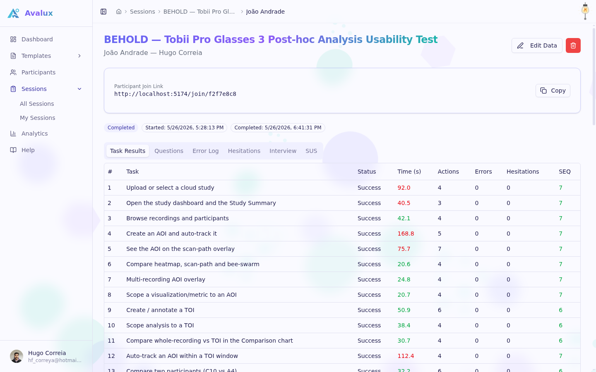

# Avalux

Avalux is an open, self-hostable web platform for moderated usability testing. It integrates the complete moderated-testing pipeline that evaluators otherwise assemble from stopwatches, spreadsheets, and questionnaire tools: reusable test protocols, a live evaluator cockpit for structured per-task logging, a participant client that runs on the participant's own device and stays synchronized in real time, standardized post-session instruments, and automatic analysis and reporting. A hosted instance runs at [avalux.pt](https://avalux.pt).



## Features

### Test templates

- Reusable protocols: tasks with optimal-path baselines (expected action counts), user-defined task groups, and typed error taxonomies.
- Per-task questions, including in-browser audio, video, and photo capture from the participant's device.
- Semi-structured interview scripts and template-scoped participant fields (study-specific attributes collected at session creation).

### Live sessions

- Evaluator cockpit: per-task timer that survives reloads and tab crashes, action counter, one-tap logging of typed errors and hesitation events with undo, and a per-task Single Ease Question (SEQ) rating.
- Keyboard shortcuts: `A` action, `1`-`9` typed errors, `H` hesitation, `Z` undo.
- Participant client on the participant's own device via join links (personal invitations or shared links), synchronized with the evaluator over realtime channels, with two-way gating so the session cannot advance while the participant is still answering.
- Task order strategies per session: fixed, shuffled, or Latin square.

### Measurement instruments

- System Usability Scale (SUS) with automatic scoring and 95% confidence intervals.
- NASA-TLX and UEQ-S as selectable post-session instruments per template.

### Analysis and reporting

- Per-task event timelines plotting logged errors and hesitations over task time.
- Analytics dashboards for completion, time on task, efficiency, and questionnaire scores.
- Self-contained PDF report export and raw data export (flat CSVs or JSON) for external statistical analysis.

### Infrastructure

- Private media storage: participant recordings live in a private bucket and render through short-lived signed URLs.
- Optional error monitoring with Sentry (errors only, no PII, no replays).
- In-app documentation at `/help`.

## Tech stack

- React 19, TypeScript, Vite
- TanStack Router (file-based routing) and TanStack Query
- Tailwind CSS 4 and shadcn/ui, Recharts for charts
- Supabase: Postgres with row-level security, Realtime, Storage, Auth
- jsPDF for report generation
- Vitest and GitHub Actions for tests and CI, deployed on Vercel

## Getting started

Prerequisites: Node.js 22+, npm, and a [Supabase](https://supabase.com) project.

1. Create `.env.local` in the repository root:

   ```
   VITE_SUPABASE_URL=https://<your-project>.supabase.co
   VITE_SUPABASE_ANON_KEY=<your-anon-key>
   # Optional: enables Sentry error monitoring
   VITE_SENTRY_DSN=<your-sentry-dsn>
   ```

2. Apply the database migrations in `supabase/migrations/` in numeric order (for example, by pasting them into the Supabase SQL editor). They set up the schema, RLS policies, storage buckets, and RPCs.

3. Install dependencies and start the dev server:

   ```
   npm install
   npm run dev
   ```

## Testing

```
npm test          # run the suite once
npm run test:watch
```

The suite (75+ tests) covers scoring and statistics (SUS, instruments, confidence intervals), metrics aggregation, task ordering, session gating, timer persistence, data export, and chart components. CI runs the tests plus a typecheck and production build on every push and pull request.

## Deployment

The app is a static single-page application and deploys directly to [Vercel](https://vercel.com) (`vercel.json` provides the SPA rewrite). Set the environment variables from the section above in the Vercel project: `VITE_SUPABASE_URL`, `VITE_SUPABASE_ANON_KEY`, and optionally `VITE_SENTRY_DSN`.

## Project structure

```
src/
  routes/       file-based routes: templates, sessions, analytics, join, help
  components/   charts, live cockpit, participant client, media, shadcn/ui primitives
  hooks/        data hooks (TanStack Query), auth, timer, theme
  lib/          domain logic: SUS and instrument scoring, stats, metrics,
                task ordering, session gating, CSV/JSON and PDF export
  types/        shared TypeScript types
supabase/
  migrations/   35 SQL migrations: schema, RLS policies, storage, RPCs
paper/          LaTeX sources of the accompanying research paper
public/help/    screenshots used by the in-app help page
```

## Research context

Avalux was built for, and validated in, moderated usability studies: the accompanying paper (sources in `paper/`) reports two case studies, an evaluation of a household touch-panel controller and an evaluation of an eye-tracking analysis dashboard, carried end to end on the platform, including a physical device beyond the reach of browser-based instrumentation. Development direction is tracked in [ROADMAP.md](ROADMAP.md) (paper-oriented work) and [FEATURES.md](FEATURES.md) (application improvements).

## License

See LICENSE.
