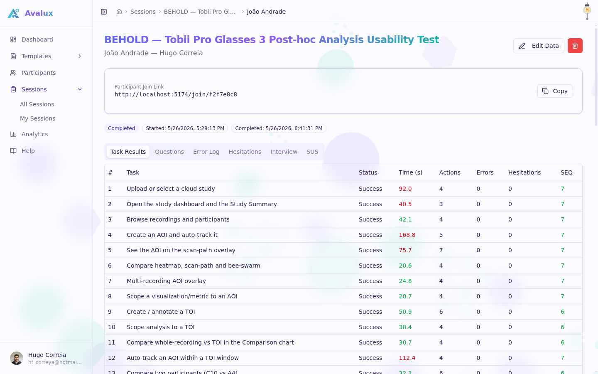

# Avalux

Avalux is an open, self-hostable web platform for moderated usability testing. It integrates the complete moderated-testing pipeline that evaluators otherwise assemble from stopwatches, spreadsheets, and questionnaire tools: reusable test protocols, a live evaluator cockpit for structured per-task logging, a participant client that runs on the participant's own device and stays synchronized in real time, standardized post-session instruments, and automatic analysis and reporting. Around that sits a teaching layer for running the method with a class: heuristic inspection before testing, instructor review of a protocol, consent, co-rating, reflection, and a view of what every team has produced. A hosted instance runs at [avalux.pt](https://avalux.pt).



## Features

### Test templates

- Reusable protocols: tasks with optimal-path baselines (expected action counts), user-defined task groups, and typed error taxonomies.
- Per-task questions, including in-browser audio, video, and photo capture from the participant's device.
- Semi-structured interview scripts and template-scoped participant fields (study-specific attributes collected at session creation).

### Live sessions

- Evaluator cockpit: per-task timer that survives reloads and tab crashes, action counter, one-tap logging of typed errors and hesitation events with undo, and a per-task Single Ease Question (SEQ) rating.
- Keyboard shortcuts: `A` action, `1`-`9` typed errors, `H` hesitation, `Z` undo.
- Participant client on the participant's own device via join links (personal invitations or shared links), synchronized with the evaluator over realtime channels, with two-way gating so the session cannot advance while the participant is still answering.
- Task order strategies per session: fixed, shuffled, or Latin square.

### Measurement instruments

- System Usability Scale (SUS) with automatic scoring and 95% confidence intervals.
- NASA-TLX and UEQ-S as selectable post-session instruments per template.

### Analysis and reporting

- Per-task event timelines plotting logged errors and hesitations over task time.
- Analytics dashboards for completion, time on task, efficiency, and questionnaire scores.
- Self-contained PDF report export and raw data export (flat CSVs or JSON) for external statistical analysis.

### Inspection and synthesis

- Heuristic inspection before testing: each evaluator records findings against a heuristic set alone, and nobody can read another pass until every pass is submitted, so an inspection cannot become one person's opinion repeated.
- Merging findings into an agreed problem list, with any-two agreement and problem coverage, so a team can see whether their passes were really independent.
- After testing, each predicted problem is marked hit or not observed and problems only testing found are added, giving thoroughness and validity against the team's own sessions as the criterion.

### Classrooms and research teams

- Organizations with owners, members and students; groups for sub-teams; projects scoped so students see only what they are assigned.
- Instructor review of a protocol before it runs: off, advisory, or required. Editing an approved protocol returns it to draft, and sessions run before approval are marked as pilots and left out of the results.
- Consent text built from a checklist of the clauses a consent form is normally made of, with a preview of what the participant reads and a warning when the right to withdraw is missing. Acceptance is timestamped on the session.
- Observer notes taken by a second person, moderator corrections recorded as they happen, co-rating of a session by a second evaluator with inter-rater agreement, and three reflection questions answered alone after each session.
- Class overview: one row per project showing the evidence each team has actually produced, with the teams waiting on you first.
- Anonymizing a participant across every session they took part in.

### Model assistance (optional, off by default)

- A model can propose which findings across evaluators, or observations across sessions, describe one underlying problem.
- Four constraints, enforced in the database rather than the interface: an organization opts in; a proposal is refused until the team has done the work itself; nothing is applied automatically, and accepting one writes the same rows a person would have written, marked `assisted`; and the model's answer is validated as untrusted input, so an invented finding id never reaches a row.
- Participant text is a separate decision, off by default and made per study. It cannot be enabled until the consent text carries a clause about automated processing, and eligibility is then a timestamp comparison: a session qualifies only if its own recorded consent is at or after the moment the study enabled it, so a study that has already run can never be included afterwards.
- Runs as a Supabase Edge Function configured by three environment variables, so it can point at any OpenAI-compatible endpoint including a model on your own infrastructure. With no key set it reports that no model is configured and nothing else changes.

### Infrastructure

- Private media storage: participant recordings live in a private bucket and render through short-lived signed URLs.
- Optional error monitoring with Sentry (errors only, no PII, no replays).
- In-app documentation at `/help`: fifteen sections with screenshots, and an eight-minute video walkthrough with chapter jump links.

## Tech stack

- React 19, TypeScript, Vite
- TanStack Router (file-based routing) and TanStack Query
- Tailwind CSS 4 and shadcn/ui, Recharts for charts
- Supabase: Postgres with row-level security, Realtime, Storage, Auth, Edge Functions (Deno)
- jsPDF for report generation, Remotion for the documentation video
- Vitest and GitHub Actions for tests and CI, deployed on Vercel

## Getting started

Prerequisites: Node.js 22+, npm, and a [Supabase](https://supabase.com) project.

1. Create `.env.local` in the repository root:

   ```
   VITE_SUPABASE_URL=https://<your-project>.supabase.co
   VITE_SUPABASE_ANON_KEY=<your-anon-key>
   # Optional: enables Sentry error monitoring
   VITE_SENTRY_DSN=<your-sentry-dsn>
   ```

2. Apply the database migrations in `supabase/migrations/` in numeric order (for example, by pasting them into the Supabase SQL editor). They set up the schema, RLS policies, storage buckets, and RPCs.

3. Install dependencies and start the dev server:

   ```
   npm install
   npm run dev
   ```

4. Optionally check the policies against your own instance. `scripts/verify/` holds a probe that reads every participant-facing table as an anonymous client and fails on any row returned, plus a PASS/FAIL script per migration that creates its own scratch data and deletes it again:

   ```
   node scripts/verify/anon-rls.mjs
   node scripts/verify/sql-lint.mjs      # before pasting any SQL
   ```

   See [`scripts/verify/README.md`](scripts/verify/README.md) for the rest.

## Testing

```
npm test          # run the suite once
npm run test:watch
```

The suite (380 tests) covers scoring and statistics (SUS, instruments, confidence intervals), metrics aggregation, task ordering, session gating, timer persistence, data export, chart components, inspection agreement and coverage, protocol review warnings, consent composition, and the validator that treats a model's answer as untrusted input. CI runs the tests plus a typecheck and production build on every push and pull request.

Load tests live in [`loadtests/`](loadtests/README.md): four [k6](https://k6.io) scenarios that replay the real client's request sequences with many simultaneous users — concurrent participant journeys, a join spike that verifies atomic invitation consumption under contention, evaluator dashboard reads, and concurrent Realtime subscriptions.

## Deployment

The app is a static single-page application and deploys directly to [Vercel](https://vercel.com) (`vercel.json` provides the SPA rewrite). Set the environment variables from the section above in the Vercel project: `VITE_SUPABASE_URL`, `VITE_SUPABASE_ANON_KEY`, and optionally `VITE_SENTRY_DSN`.

### Model assistance (optional)

Nothing below is needed to run the platform. Without it the feature reports that no model is configured, and everything else works unchanged.

```
supabase functions deploy inspection-suggest
supabase functions deploy session-summary
supabase secrets set AI_API_KEY=... AI_API_URL=... AI_MODEL=...
```

`AI_API_URL` is any OpenAI-compatible chat completions endpoint, so this can point at a hosted provider or at a model on your own infrastructure. Before deploying, check a provider end to end, including whether it will actually be billed:

```
npx tsx scripts/verify/ai-provider.mts
```

An organization owner then turns suggestions on in the organization's settings; it is off by default. See [`supabase/functions/inspection-suggest/README.md`](supabase/functions/inspection-suggest/README.md) for what is sent and what protects it.

## Project structure

```
src/
  routes/       file-based routes: templates, sessions, analytics, join, help
  components/   charts, live cockpit, participant client, media, shadcn/ui primitives
  hooks/        data hooks (TanStack Query), auth, timer, theme
  lib/          domain logic: SUS and instrument scoring, stats, metrics,
                task ordering, session gating, CSV/JSON and PDF export
  types/        shared TypeScript types
supabase/
  migrations/   60 SQL migrations: schema, RLS policies, storage, RPCs
  functions/    Edge Functions: the two model-assistance endpoints
scripts/
  verify/       checks run by hand against a deployed instance: RLS probes,
                a SQL linter, and a script that tests a model provider before
                anything is deployed
  help-screenshots/  the real app with a stubbed database and fictional data,
                driven to capture the help-page screenshots
video/          Remotion sources for the documentation video
paper/          LaTeX sources of the accompanying research paper
public/help/    screenshots used by the in-app help page
```

## Research context

Avalux was built for, and validated in, moderated usability studies: the accompanying paper (sources in `paper/`) reports two case studies, an evaluation of a household touch-panel controller and an evaluation of an eye-tracking analysis dashboard, carried end to end on the platform, including a physical device beyond the reach of browser-based instrumentation. The paper also argues the teaching case, that several features here deliberately add work rather than save it, and sets out a classroom study designed to test it; that claim is not yet evaluated. Development direction is tracked in [ROADMAP.md](ROADMAP.md) (paper-oriented work) and [FEATURES.md](FEATURES.md) (application improvements).

## License

See LICENSE.
